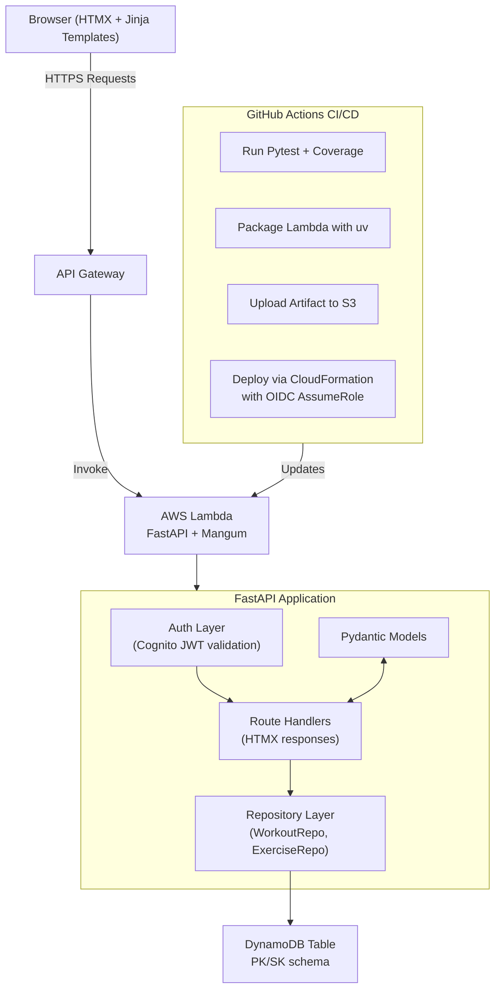

# ElbieFit 🏋️‍♀️

ElbieFit is a lightweight workout-logging web application built with FastAPI, HTMX, and AWS serverless infrastructure.

The goal is to provide a simple, fast, modern interface that allows users to log workouts, track progress, and manage profiles — backed by clean architecture and test-focused development.

# 🚀 Features

## Backend

- FastAPI application running on AWS Lambda via Mangum
- Cognito authentication (hosted UI → callback → session cookies)
- DynamoDB datastore using a repository layer
- Pydantic models for validation

## Frontend

- HTMX/Jinja templates rendered server-side
- Custom CSS (no Tailwind/Bootstrap) for a simple, responsive UI

## Tooling & CI/CD

- GitHub Actions pipeline for automated tests and deployments
- CloudFormation templates to provision AWS resources
- OIDC trust for secure GitHub → AWS deployments (no long-lived AWS keys)
- Pipeline runs tests and pushes code to the test Lambda on every push to `main`

Bash scripts for:

- Deploying CloudFormation stacks
- Packaging Lambda code with uv
- Uploading build artifacts
- Updating Lambda code in place
- Unit tests via pytest, including coverage

# Architechture

# 🧪 Live Demo (TODO)

App URL: TBC

Demo user (shared):

- Email: demo+elbiefit@example.com
- Password: TBC

Note: This is a shared demo account – data may be reset periodically.
